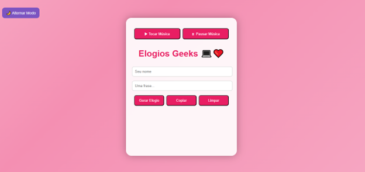

# 💌 Gerador de Elogios Romântico com Modo Noturno

Este é um projeto divertido e encantador feito com HTML, CSS e JavaScript que permite ao usuário digitar seu nome e uma frase personalizada para gerar elogios românticos com emojis, música ambiente e animações fofas.

---

---

## 🌟 Funcionalidades

- Entrada de **nome** e **frase personalizada**.
- Gera elogios aleatórios com emojis e efeitos.
- Música ambiente ao gerar a mensagem.
- Efeito sonoro ao copiar a mensagem.
- Emojis animados surgem na tela.
- Botões para **copiar o elogio**, **limpar os campos** e **controlar a música**.
- Botão para alternar entre **modo claro** e **modo noturno romântico**.

---

## 🛠 Arquivos

- `index.html` - Estrutura da página.
- `styles.css` - Estilização da interface e responsividade.
- `script.js` - Lógica de geração de elogios e interação.
- `src/musica1.mp3` - Trilha sonora ambiente.
- `src/efeito.mp3` - Efeito ao copiar.

---

## 🚀 Como Usar

1. Clone ou baixe este repositório.
2. Certifique-se de que todos os arquivos estão na mesma pasta.
3. Abra o arquivo `index.html` em seu navegador.
4. Preencha os campos com seu nome e uma frase carinhosa.
5. Clique em **Gerar Elogio**.
6. Use os botões para **copiar**, **limpar**, **controlar a música** e **ativar o modo noturno**.

---

## 💡 Ideias Futuras

- Permitir upload de foto para deixar mais personalizado.
- Compartilhar elogio direto nas redes sociais.
- Adicionar temas e paletas de cor diferentes.

---

## 🧡 Feito com muito carinho!

Este projeto é ideal para quem quer aprender JavaScript brincando, criar uma experiência afetiva e encantadora ou simplesmente arrancar sorrisos de quem você ama!

Fique à vontade para modificar, melhorar ou compartilhar com quem você quiser! ✨

